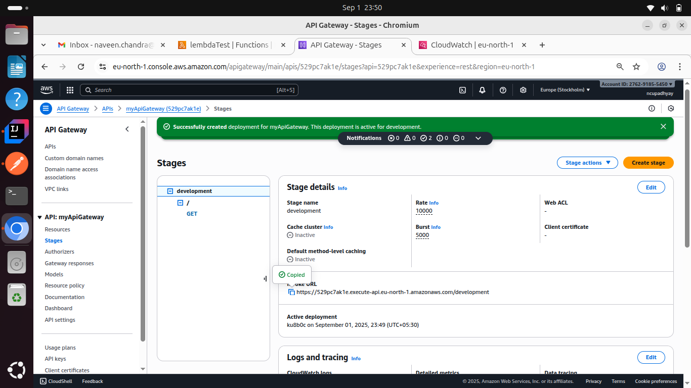

# API Gateway 
It serves as a centralized entry point for managing and routing requests from clients to the appropriate microservices or backend services within a system.

It works b/w client and micro-services.

1. Use case
   1. Authentication 
   2. Rate Limit
   3. Monitoring

[//]: # ()
