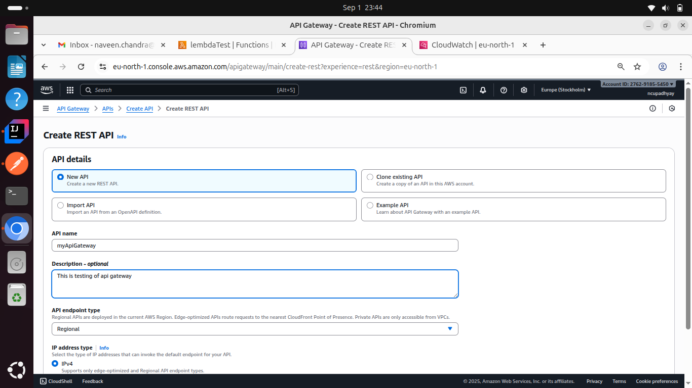
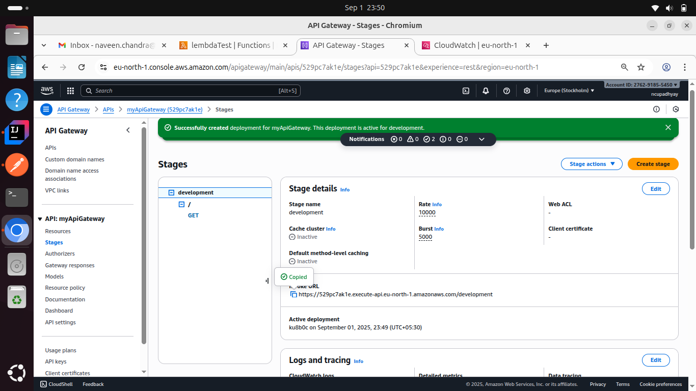
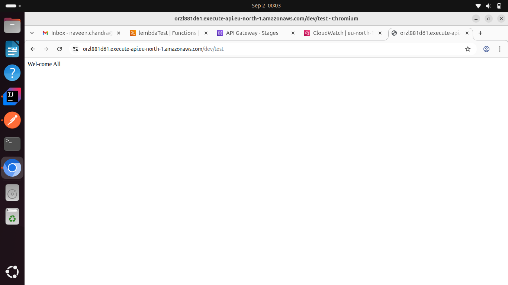
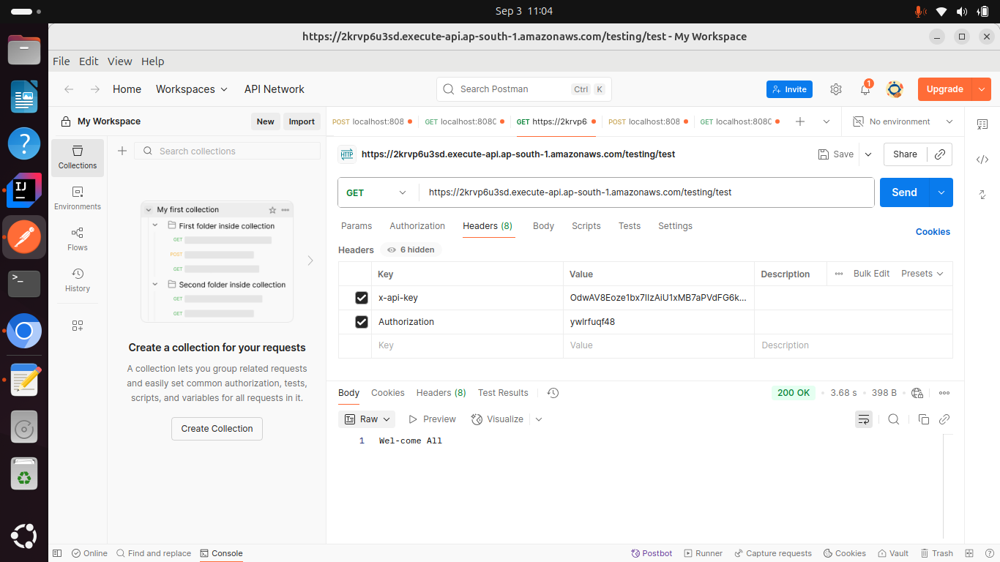
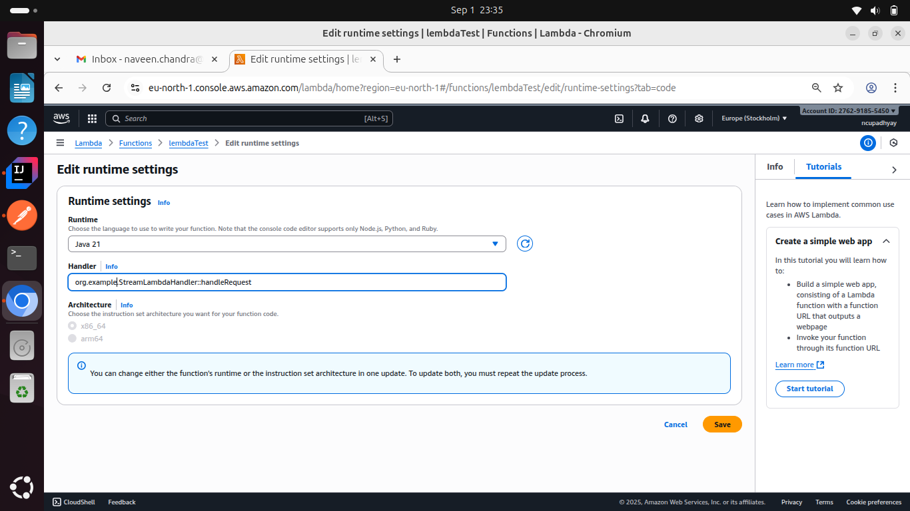
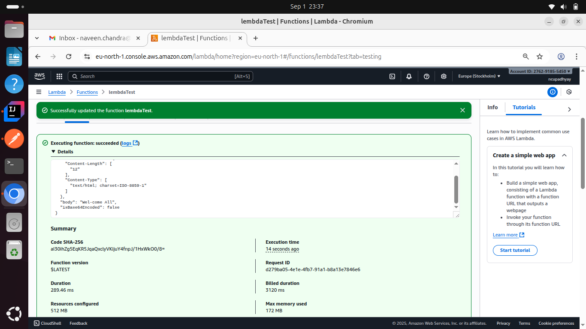

## Topic
1. [API Gateway](#1-api-gateway-)
2. [Api Authentication](#2-api-authentication)
3. [Aws Lambda](#3-aws-lambda-)

## 1. API Gateway 
It serves as a centralized entry point for managing and routing requests from clients to the appropriate microservices or backend services within a system.

It works b/w client and micro-services.

1. Use case
   1. Authentication 
   2. Rate Limit
   3. Monitoring

[//]: # ()
Api Gateway Creation process ...

Set http methods

Output when hit the api gateway url

## 2. Api Authentication
API authentication is an important security process that authenticates the identity of users or applications prior to providing API access. It makes sure that only legitimate entities interact with an API, avoiding unauthorized access, data exposure, and API misuse.
Using api authentication you can secure you api. by this you can prevent from D-DOS attack.in this client set api key in header as x-api-key

### Usecase
1. Rate limiting
2. Identifying different client

## 3. AWS Lambda 
AWS lambda are server-less compute functions are fully managed by the AWS where developers can run their code without worrying about servers. AWS lambda functions will allow you to run the code with out provisioning or managing servers.
### Features 
1. File Processing : Aws lambda can trigger using s3.
2. Provide high availability
3. Serverless execution
4. Pay-per-use pricing
5. Supports different programming languages
6. integrate with other aws services and SAAS application

Creating aws lambda

Executing aws lambda

