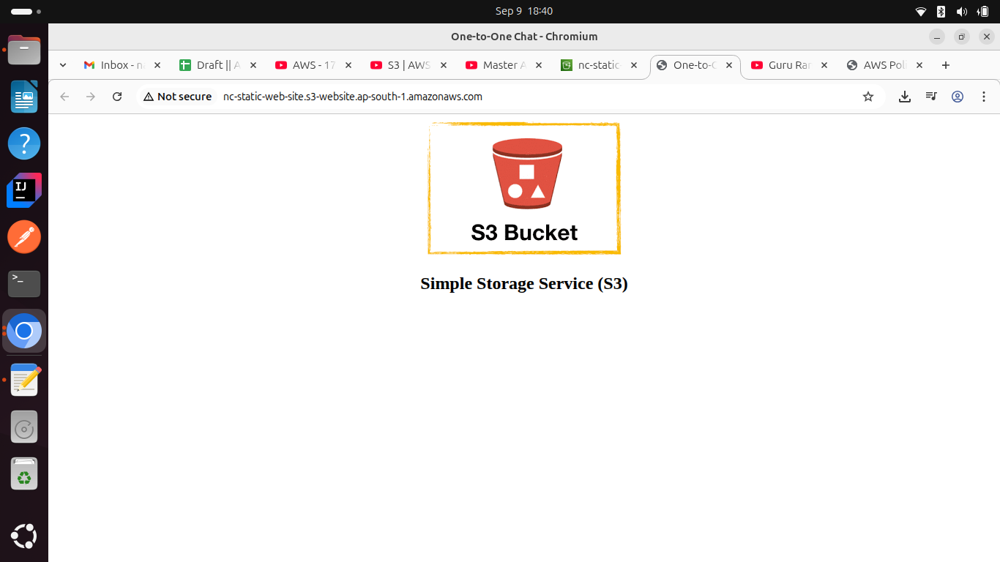

## Topic
1. [API Gateway](#1-api-gateway-)
2. [Api Authentication](#2-api-authentication)
3. [Aws Lambda](#3-aws-lambda-)
4. [AWS Cognito](#4-amazon-cognito)
5. [Simple Storage Service](#5-simple-storage-service-s3)
6. [Load Balancer](#6-load-balancer)
7. [Auto Scaling](#7-auto-scaling)

## 1. API Gateway 
It serves as a centralized entry point for managing and routing requests from clients to the appropriate microservices or backend services within a system.

It works b/w client and microservices.

1. Use case
   1. Authentication 
   2. Rate Limit
   3. Monitoring

[//]: # ()
Api Gateway Creation process ...

Set http methods

Output when hit the api gateway url

## 2. Api Authentication
API authentication is an important security process that authenticates the identity of users or applications prior to providing API access. It makes sure that only legitimate entities interact with an API, avoiding unauthorized access, data exposure, and API misuse.
Using api authentication you can secure you api. by this you can prevent from D-DOS attack.in this client set api key in header as x-api-key

### Usecase
1. Rate limiting
2. Identifying different client

## 3. AWS Lambda 
AWS lambda are server-less compute functions are fully managed by the AWS where developers can run their code without worrying about servers. AWS lambda functions will allow you to run the code with out provisioning or managing servers.
### Features 
1. File Processing : Aws lambda can trigger using s3.
2. Provide high availability
3. Serverless execution
4. Pay-per-use pricing
5. Supports different programming languages
6. integrate with other aws services and SAAS application

Creating aws lambda

Executing aws lambda

##  4. Amazon Cognito
It is aws service that provide user authentication,authorization and provide management of web and mobile 
application. while users cognito pool is the user directory that handle user sign in and sign up process for 
users to access the application.

Cognito pool provide aws credential to grant your user access to other aws services.

#### Sign In process using cognito services

#### Sign up process using cognito services

#### Sign in successful. below is the default page provided by aws we can set our custom page alos for that we need to set our page url

#### User sign in/up data 

## 5. Simple storage service (S3)
Amazon S3 is a Simple Storage Service in AWS that stores files of different types like Photos, Audio, and Videos as Objects providing more scalability and security to. It allows the users to store and retrieve any amount of data at any point in time from anywhere on the web. It facilitates features such as extremely high availability, security, and simple connection to other AWS Services.
#### Usecases
1. Data storage
2. Backup & recovery
3. Hosting static website
4. Data Archive
5. Big Data Analytics

#### S3 Bucket
Amazon S3 works on organizing the data into unique S3 Buckets, customizing the buckets with Acccess controls. It allows the users to store objects inside the S3 buckets with facilitating features like versioning and lifecycle management of data storage with scaling

#### S3 Versioning:
Versioning means always keeping a record of previously uploaded files in S3. Points to Versioning are not enabled by default. Once enabled, it is enabled for all objects in a bucket. Versioning keeps all the copies of your file, so, it adds cost for storing multiple copies of your data.

#### S3 storage classes
1. Standard: Suitable for frequently accessed data, that needs to be highly available and durable.
2. Standard Infrequent Access: this class is best suited for storing infrequently accessed data.
3. Intelligent Tiering: This service class classifies your files automatically into frequently accessed and infrequently accessed and stores the infrequently accessed data in infrequent access storage to save costs.

#### Create s3 bucket

#### S3 bucket properties

#### S3 bucket Policy

#### S3 bucket for replication of data
In this we create a s3 bucket(bucket A) and it is associated with some other bucket(it may be same region/AC or some other region/AC) e.g bucket B.
when we upload an object on bucket B then a replica of object created in the other bucket( bucket A).

#### Host static website in s3 bucket

#### Netlify Home Page
It is used for hosting web application

#### Host website in netlify

## 6. Load Balancer
A Load Balancer is a system that automatically distributes incoming network traffic (requests) across multiple servers.
On AWS, load balancing is managed by the Elastic Load Balancing (ELB) service.ELB automatically distributes incoming application traffic across multiple EC2 instances, containers, IP addresses, or Lambdas in one or more Availability Zones
Its main goals-:
1. Prevent any single server from being overloaded.
2. Increase availability and reliability (if one server fails, traffic shifts to others).
3. Improve performance by balancing workload.

#### Types of AWS Load Balancers
1. ##### Application Load Balancer (ALB)
- Operates at Layer 7 (Application Layer).
- Smart routing based on HTTP/HTTPS request content (URLs, headers, query strings).
- Supports path-based and host-based routing.
- Best for web applications, microservices, APIs.

2. ##### Network Load Balancer (NLB)
- Operates at Layer 4 (Transport Layer).
- Handles millions of requests per second with ultra-low latency.
- Works at TCP, UDP, and TLS levels.
- Best for high-performance apps, gaming, IoT, or real-time streaming.

3. ##### Classic Load Balancer (CLB) (Legacy)
- Works at both Layer 4 and Layer 7 but with limited features.
- Older generation, gradually being replaced by ALB/NLB.
- Still used for basic load balancing.

4. ##### Gateway Load Balancer (GWLB)
- Works at Layer 3 (Network Layer).
- Used for transparent network traffic inspection.
- Integrates with firewalls, intrusion detection/prevention systems.

##### Routing Algorithms in AWS ELB
- Round Robin (Default in ALB & CLB for HTTP/HTTPS)
- Least Outstanding Requests (ALB & CLB for TCP)
- Flow Hash Algorithm (NLB)
- Sticky Sessions (Session Affinity)

##### Create Load Balancer 

##### Target Group 

##### EC-2 Instances 

##### Running Site 

## 7. Auto Scaling
Auto Scaling in AWS automatically adjusts the number of compute resources (like EC2 instances, ECS tasks, DynamoDB capacity, etc.) to handle application traffic efficiently.

#### Goal:
- Scale out (add instances) when demand increases.
- Scale in (remove instances) when demand decreases.
- Save cost while maintaining performance.

#### Steps to Set Up EC2 Auto Scaling in AWS
- Create launch template. so that other instance created according to it.
- Create auto scaling group. define min, max and desire instances.
- Configure scaling policy.

##### Create Load Balancer

##### Create Target Group

##### Running desire instances or minimum instances

